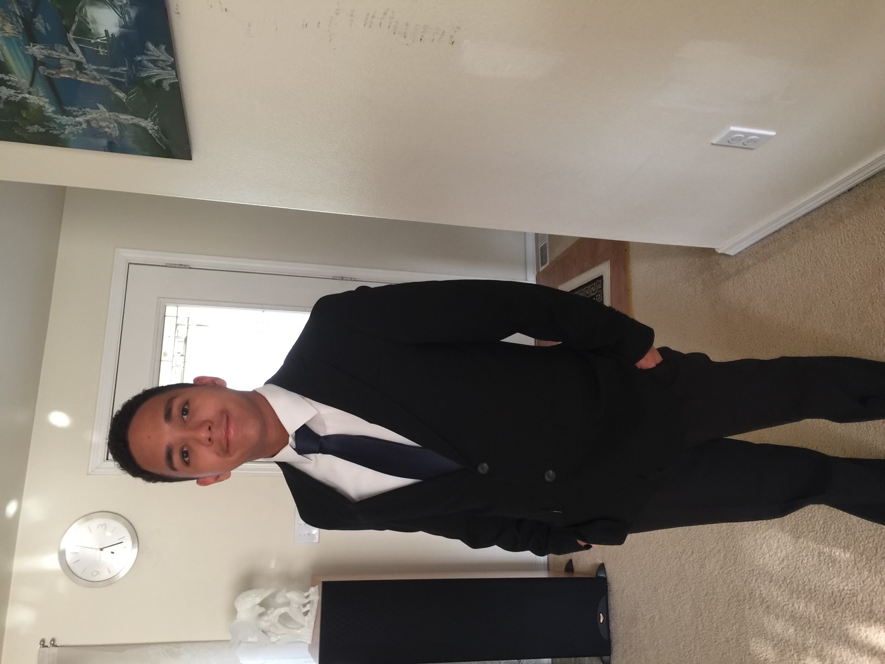

<!--
**TravisHo9/TravisHo9** is a ✨ _special_ ✨ repository because its `README.md` (this file) appears on your GitHub profile.

Here are some ideas to get you started:

- 🔭 I’m currently working on ...
- 🌱 I’m currently learning ...
- 👯 I’m looking to collaborate on ...
- 🤔 I’m looking for help with ...
- 💬 Ask me about ...
- 📫 How to reach me: ...
- 😄 Pronouns: ...
- ⚡ Fun fact: ...
-->

<!-- # Travis Ho
## Major: Bachelors of Computer Science
## Minor: Minor in Cyber Security

## Skills: Java, Python, C, HTML, CSS, Javascript

## What I want to do: I want to be a software developer whether it is being a front-end or back-end, I can do both.

## About myself: Hard working individual that specializes in debugging and solving the problem. Main language I use is java -->

Hi there! 👋 My name is Travis Ho
=================================================================================================================================

Software Engineer and Web Developer
-----------------------------------

I've been learning to code for more than 4 years. I started with Python and eventually learning how to use Java. I have found passion for backend development and currently working on frontend development

* 🌍  I'm based in Washington
* 🖥️  See my portfolio at [GitHub](http://github.com/TravisHo9)
* 🧠  I'm learning HTML, CSS, and JS
* 🤝  I'm open to collaborating on Websites

### Skills

### Socials

 <a href="https://www.github.com/TravisHo9" target="_blank" rel="noreferrer"> <picture> <source media="(prefers-color-scheme: dark)" srcset="https://raw.githubusercontent.com/danielcranney/readme-generator/main/public/icons/socials/github-dark.svg" /> <source media="(prefers-color-scheme: light)" srcset="https://raw.githubusercontent.com/danielcranney/readme-generator/main/public/icons/socials/github.svg" />  </picture> </a>

### Badges

